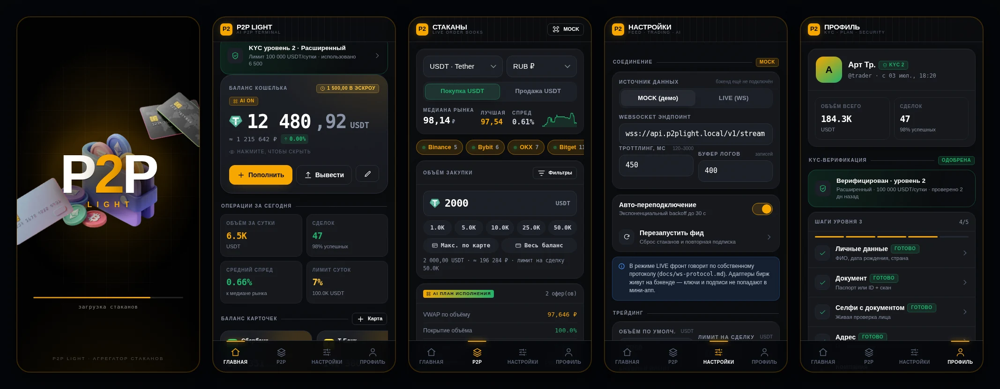

# P2P Light

Telegram Mini App: агрегатор P2P-стаканов криптобирж с AI-анализом контекста
сделки. Оформление — палитра Bybit (оранжевый `#F7A600`, чёрный, белый).
Шрифты — Onest (интерфейс) и Unbounded (крупные заголовки). Фронтенд без
сборки, на нативных ES-модулях: открывается двойным кликом по `index.html`,
разворачивается на любом статик-хостинге.



## Запуск

```bash
# любой статик-сервер, потому что ES-модули не грузятся с file://
python3 -m http.server 8080
# → http://localhost:8080
```

### Сборка в один файл

```bash
python3 tools/bundle.py          # → dist/index.html (~398 KB)
```

CSS, все модули и графика (иконки монет, ассеты сплэша) встраиваются внутрь;
снаружи остаются только Google Fonts и Telegram WebApp SDK. Такой файл
открывается двойным кликом и заливается на любой хостинг как есть. Для
встраивания берутся уменьшенные копии логотипов из `assets/coins/min/`
(оригиналы в `assets/coins/` не трогаются).

Внутри Telegram: BotFather → `/newapp` → указать URL. Вне Telegram SDK уходит
в заглушку, всё работает в обычном браузере.

## Что уже есть

**Загрузочный экран**
- «P2P» — самый крупный элемент, «2» акцентно-оранжевая; «Light» ниже, в разрядку
- Плоский тёмный фон без подсветки; предметы прилетают с разных сторон
  (кошелёк позади надписи, карты из противоположных углов), затем экран
  затемняется, предметы исчезают — и происходит переход на главный экран
- Внизу подпись `slu&dudka`
- 3D-ассеты вырезаны из исходных рендеров (фон снят, альфа сглажена) и лежат
  в `assets/splash/` как WebP
- Последовательность по таймингу (прилёт → пауза → уход ≈ 1.75 + 0.64 с) со
  страховочным таймаутом, чтобы заставка не залипла, если старт упадёт

**Главная**
- Баланс USDT: тап по сумме скрывает/показывает его (размывается, состояние
  запоминается), отдельно показан эскроу по активным сделкам
- Правка баланса: установить / пополнить / вывести
- Баланс карточек — горизонтальный раил с лимитами и прогрессом использования,
  добавление/правка/удаление; фиат на закупки списывается именно отсюда.
  По умолчанию карт нет — показывается плитка «+ Добавить карту»
- Без демо-данных: баланс, карты, статистика стартуют с нуля
- Промо-баннер → колесо фортуны (слоты, честный прокрут result-first,
  призы зачисляются; прокруты зарабатываются за задания)
- Задания недели: трекер с прогрессом (5 закупок, объём 10 000 USDT, KYC,
  карта), сброс по понедельникам, за полное выполнение — прокрут колеса
- KPI за сутки, последние закупки с таймлайном статусов

**P2P** — сюда сведены стаканы всех бирж
- 8 площадок: Binance, Bybit, OKX, Bitget, HTX, KuCoin, MEXC, Gate.io
- Агрегированный стакан с depth-барами, отклонением от медианы, бейджами
  verified/pro/KYC, способами оплаты
- Регион: все страны (ISO-3166) с флагами; регион задаёт валюту и способы
  оплаты, стакан фильтруется по нему. Выбор при первом входе (обязательный),
  меняется в любой момент (чип в шапке P2P или в Профиле)
- Активы: USDT, BTC, ETH, BNB, SOL, TON; покупка/продажа; валюта — из региона
- Объём закупки в USDT: ручной ввод, быстрые пресеты, «макс. по карте»,
  «весь баланс»
- Фильтры: биржи, цена, объём, способы оплаты, % исполнения, число сделок,
  verified / pro / онлайн / блоклист, «проходит мой объём»; 6 сортировок
- Поиск по стакану: ввод подсвечивает все совпадения (мерчант, цена, лимиты,
  проценты) во всех оферах сразу, со счётчиком совпадений
- AI-план исполнения: VWAP по объёму, покрытие, слиппедж, разбивка по оферам
- Контекст сделки по оферу: вердикт, скор 0–100, 6 взвешенных факторов,
  экономика (комиссия, эффективная цена, цена выхода, ожидаемая прибыль),
  факторы риска, блокеры
- Описание ордера: тап по оферу раскрывает условия продавца/покупателя
  (ремарку контрагента), ниже — AI-анализ и экономика сделки
- Лента событий: аккуратная лента (иконка уровня + тег биржи + текст,
  моноширинный шрифт только для чисел), фильтр по уровням, пауза, экспорт в JSON

**Настройки** — скорость обновления, буфер логов, лимиты сделок, слиппедж,
целевая маржа, веса AI-модели, биржи и ключи, уведомления, тема
(тёмная/светлая, обе в палитре Bybit), экспорт/импорт

**Профиль** — KYC-верификация (3 уровня, пошаговая анкета с валидацией,
статусы `none → draft → pending → approved/rejected`), тариф B2B с метриками
использования, 2FA, API-токен, сессии, статистика

**Закупки блокируются без KYC уровня 1** — и в UI, и в `preflight()`.

## Архитектура

```
index.html            оболочка: сплэш, топбар, вью, таббар
assets/splash/        вырезанные 3D-ассеты (WebP)
styles/               tokens → base → components → screens → splash
src/
  core/   store.js    состояние + pub/sub + выборочный localStorage
          router.js   4 вкладки, монтирование/размонтирование экранов
          dom.js      h(), icon(), sparkline() — вместо фреймворка
          format.js   деньги, проценты, время
  data/   exchanges.js  биржи, активы (цена в USD), курсы валют
          regions.js    все страны ISO-3166, флаги, валюты, способы оплаты
  services/
          feed.js     WS-клиент + mock-генератор стаканов
          analysis.js скоринг сделки, план исполнения
          trade.js    preflight + жизненный цикл ордера
          kyc.js      машина состояний верификации
          telegram.js WebApp SDK с безопасным фолбэком
  ui/                 splash, sheet, toast, offerSheet, filterSheet,
                      dealSheet, regionSheet, wheel, quests
  screens/            home, p2p, settings, profile
docs/ws-protocol.md   контракт для бэкенда
```

Состояние — один объект с подписками по неймспейсам (`on('offers', fn)`).
Персистятся только пользовательские срезы; оферы и логи живут в памяти.

Стакан обновляется **по месту** (keyed reconciliation) и пересортировывается
не чаще раза в ~1.1 с — иначе строка уезжает из-под пальца в момент тапа.

## Поток данных

Пока бэкенда нет, стаканы наполняет локальный генератор: 8 площадок, случайное
блуждание цены, появление и снятие оферов, таймауты, алерты по спреду. Он
отдаёт ровно те же события, что и бэкенд, поэтому ордера всегда видны, а
подключение сервера сведётся к смене источника — без правок UI.

`feed.js` уже умеет и live-режим (`WebSocket` по контракту из
`docs/ws-protocol.md`), но переключателя в интерфейсе нет: пустой/мёртвый
эндпоинт показывал бы пустой стакан, поэтому выбор убран до появления бэкенда.

## Безопасность фронта

Фронт нельзя считать доверенным (DevTools открыты у всех), поэтому защита
реализована на клиенте как «бережёт UI и отсекает мусор», и те же проверки
обязаны дублироваться на сервере. Подробности и требования к бэкенду —
`docs/ws-protocol.md`, раздел 8.

- **Replay**: `auth` с `nonce`+`ts`; входящие кадры проверяются на свежесть
  (окно 120 с) и дедуп по `id`/`seq`; у каждой закупки `idemKey`; двойной тап
  по «Закупить» подавляется локом.
- **DDoS/флуд через фронт**: лимит входящего потока (300 кадров/с), отбрасывание
  бинарных и >512 КБ кадров, потолок оферов в памяти (1500) и батча (600),
  санитизация каждого офера, дебаунс пере-подписки, джиттер переподключения.
- **XSS**: имена мерчантов и текст логов экранируются при выводе — в разметку
  проходят только `<b>`/`</b>`.

## Что остаётся бэкенду

Всё, что в `docs/ws-protocol.md`: адаптеры бирж, нормализация оферов,
проверка `initData` по HMAC, создание сделок (идемпотентно), серверные лимиты,
KYC-провайдер. Проверки в `preflight()` — для UX; на сервере их надо повторить.

Исполнение сделок, баланс и KYC-ревью сейчас симулируются на фронте,
чтобы весь путь можно было пройти и посмотреть до бэкенда.

## Лицензия

Приватный проект.

## Подготовка 3D-ассетов

Исходные рендеры пришли как JPEG со студийным фоном (у кошелька — запечённая
шахматка «прозрачности»). Фон снят скриптом `tools/cutout.py`:

- **кошелёк** — шахматка это светлые почти-серые пиксели, связанные с рамкой
  кадра; берём самый крупный компонент того, что осталось;
- **тёмные карты** — карты строго нейтральные (R=G=B), а фон и запечённая
  тень коричневые (R>G>B), поэтому отделяются по одному признаку;
- **белая карта** — самый тяжёлый случай: её серый почти совпадает с фоновым
  градиентом, а к верхней кромке липнет ореол свечения кольца. Градиент
  описывается полиномом по рамке кадра и вычитается, а силуэт берётся не из
  маски, а из прямых рёбер самой карты (Хаф) — четвёртое ребро достраивается
  проекцией маски внутри полосы между длинными рёбрами, чтобы ореол не попал
  в расчёт.

Нужны `pillow`, `numpy`, `scipy`, `scikit-image`. Скрипт одноразовый: готовые
ассеты уже лежат в `assets/splash/`.
