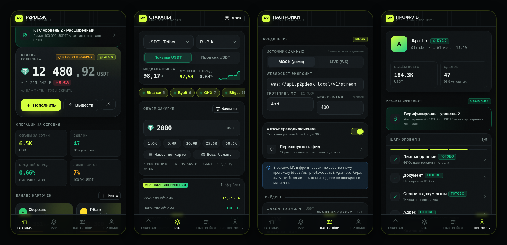

# P2PDesk

Telegram Mini App: агрегатор P2P-стаканов криптобирж с AI-анализом контекста
сделки. Фронтенд — без сборки, на нативных ES-модулях: открывается двойным
кликом по `index.html`, разворачивается на любом статик-хостинге.



## Запуск

```bash
# любой статик-сервер, потому что ES-модули не грузятся с file://
python3 -m http.server 8080
# → http://localhost:8080
```

Внутри Telegram: BotFather → `/newapp` → указать URL. Вне Telegram SDK уходит
в заглушку, всё работает в обычном браузере.

## Что уже есть

**Главная**
- Баланс USDT: тап по сумме скрывает/показывает его (размывается, состояние
  запоминается), отдельно показан эскроу по активным сделкам
- Правка баланса: установить / пополнить / вывести
- Баланс карточек — горизонтальный раил с лимитами и прогрессом использования,
  добавление/правка/удаление; фиат на закупки списывается именно отсюда
- KPI за сутки, последние закупки с таймлайном статусов

**P2P** — сюда сведены стаканы всех бирж
- 8 площадок: Binance, Bybit, OKX, Bitget, HTX, KuCoin, MEXC, Gate.io
- Агрегированный стакан с depth-барами, отклонением от медианы, бейджами
  verified/pro/KYC, способами оплаты
- Пары: USDT, BTC, ETH, BNB, SOL, TON × RUB, USD, EUR, UAH, KZT; покупка/продажа
- Объём закупки в USDT: ручной ввод, быстрые пресеты, «макс. по карте»,
  «весь баланс»
- Фильтры: биржи, цена, объём, способы оплаты, % исполнения, число сделок,
  verified / pro / онлайн / блоклист, «проходит мой объём»; 6 сортировок
- AI-план исполнения: VWAP по объёму, покрытие, слиппедж, разбивка по оферам
- Контекст сделки по оферу: вердикт, скор 0–100, 6 взвешенных факторов,
  экономика (комиссия, эффективная цена, цена выхода, ожидаемая прибыль),
  факторы риска, блокеры
- Консоль логов: live-поток событий стаканов, фильтр по уровням, пауза,
  экспорт в JSON

**Настройки** — WS-эндпоинт и режим фида, троттлинг, лимиты сделок, слиппедж,
целевая маржа, веса AI-модели, биржи и ключи, уведомления, тема, экспорт/импорт

**Профиль** — KYC-верификация (3 уровня, пошаговая анкета с валидацией,
статусы `none → draft → pending → approved/rejected`), тариф B2B с метриками
использования, 2FA, API-токен, сессии, статистика

**Закупки блокируются без KYC уровня 1** — и в UI, и в `preflight()`.

## Архитектура

```
index.html            оболочка: топбар, вью, таббар
styles/               tokens → base → components → screens
src/
  core/   store.js    состояние + pub/sub + выборочный localStorage
          router.js   4 вкладки, монтирование/размонтирование экранов
          dom.js      h(), icon(), sparkline() — вместо фреймворка
          format.js   деньги, проценты, время
  data/   exchanges.js  реестр бирж, активов, фиатов
  services/
          feed.js     WS-клиент + mock-генератор стаканов
          analysis.js скоринг сделки, план исполнения
          trade.js    preflight + жизненный цикл ордера
          kyc.js      машина состояний верификации
          telegram.js WebApp SDK с безопасным фолбэком
  ui/                 sheet, toast, offerSheet, filterSheet, dealSheet
  screens/            home, p2p, settings, profile
docs/ws-protocol.md   контракт для бэкенда
```

Состояние — один объект с подписками по неймспейсам (`on('offers', fn)`).
Персистятся только пользовательские срезы; оферы и логи живут в памяти.

Стакан обновляется **по месту** (keyed reconciliation) и пересортировывается
не чаще раза в ~1.1 с — иначе строка уезжает из-под пальца в момент тапа.

## Режимы данных

| режим | что делает |
|---|---|
| `mock` (по умолчанию) | локальный генератор: 8 площадок, случайное блуждание цены, появление и снятие оферов, таймауты, алерты по спреду |
| `live` | `WebSocket` по контракту из `docs/ws-protocol.md` |

Переключается в Настройках или кнопкой в топбаре вкладки P2P. Mock отдаёт
ровно те же события, что и бэкенд, — подключение сводится к смене URL.

## Что остаётся бэкенду

Всё, что в `docs/ws-protocol.md`: адаптеры бирж, нормализация оферов,
проверка `initData` по HMAC, создание сделок (идемпотентно), серверные лимиты,
KYC-провайдер. Проверки в `preflight()` — для UX; на сервере их надо повторить.

Исполнение сделок, баланс и KYC-ревью сейчас симулируются на фронте,
чтобы весь путь можно было пройти и посмотреть до бэкенда.

## Лицензия

Приватный проект.
